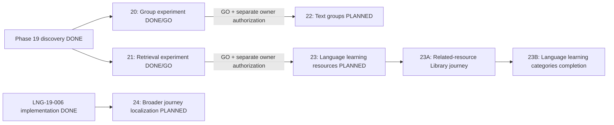

# Post-Phase-19 V2 Roadmap

Current roadmap maintenance addendum — 2026-10-07: Phase 20 and Phase 21 are
DONE/GO. Phase 22 and Phase 23 are technically eligible but remain unstarted and
execution-unauthorized; Phase 24 also remains unstarted and unauthorized. Phase 23
is now the umbrella **Verified Language Learning Resource Journey**, split into
23A **Verified Related-Resource Library Journey** and 23B **Language Learning
Categories Completion**. The detailed owner-approved scope is recorded in
[V2-ROADMAP-PHASE-23-LANGUAGE-HUB-AMENDMENT.md](V2-ROADMAP-PHASE-23-LANGUAGE-HUB-AMENDMENT.md).
This roadmap maintenance does not authorize implementation, deployment, database
mutation, telemetry, provider activation or any next major phase.

Phase 21 remains closed under its reviewed
[GO verdict](../phases/PHASE-21-RELATIONAL-RETRIEVAL-EXPERIMENT/VERDICT.md) and
[technical inheritance contract](../phases/PHASE-21-RELATIONAL-RETRIEVAL-EXPERIMENT/HANDOFF.md).
Its evidence is not broadened by this planning amendment. In particular, contextual
discovery is the accepted scope; general free-text search superiority, unseen-corpus
generalization, human linguistic certification, real-user value and atomic SQL
concurrency remain unproven.

Owner-approved planning record, 2026-10-07 (Asia/Ho_Chi_Minh).
This is the authoritative forward roadmap, not an execution authorization. Phase
plans/task decompositions may be executed only when the owner separately authorizes
the selected major phase.

## Accepted inputs and completed work

- [Product vision](00-PRODUCT-VISION.md) and [principles](01-PRODUCT-PRINCIPLES.md):
  people-first language communities, reusable open knowledge and visible trust.
- Closed [Phase 19 portfolio](../phases/PHASE-19-GROWTH-V2/PORTFOLIO.md),
  [discovery index](../phases/PHASE-19-GROWTH-V2/DISCOVERY-INDEX.md),
  [speech/economy discovery](../phases/PHASE-19-GROWTH-V2/DISCOVERY-002-003.md),
  [groups/client/localization discovery](../phases/PHASE-19-GROWTH-V2/DISCOVERY-004-006.md)
  and [ML/retrieval discovery](../phases/PHASE-19-GROWTH-V2/DISCOVERY-007-008.md).
- Completed [LNG-19-006 implementation](../initiatives/LNG-19-006-MULTILINGUAL-UI/README.md)
  and [acceptance evidence](../initiatives/LNG-19-006-MULTILINGUAL-UI/EVIDENCE.md):
  browser-only static vi/en locale infrastructure, shared shell and public Library
  journey are DONE. Existing English copy retains its truthful human-review status.
- Phase 20 is DONE/GO under its accepted policy/authorization experiment evidence.
- Phase 21 is DONE/GO. Backend main at Phase 21 closeout is
  `77f8824d11cc843ee93f681af7b649889edd680d`; Frontend remains
  `7cf66654da6419ca5447673e5d3782560856b4bc`; Workspace closeout main is
  `f1c82e1b9800d9fa5c31114aed78530fe781e3f4` before this roadmap-only amendment.

Phase 19 discovery stays historically DONE. Real-user demand remains unproven.
Seed/demo/TEST/UAT data supports technical validation only. No fake observation
window or post-launch demand/retention/conversion claim is required.

## Order and dependencies

| Recommended order | Phase | Product capability | Required technical gate |
|---|---|---|---|
| 1 | 20 | Scoped study group policy and authorization experiment | DONE / GO |
| 2 | 21 | Provenance-safe relational retrieval experiment | DONE / GO |
| 3 | 22 | Bounded text study groups | Phase 20 GO and accepted membership/moderation lifecycle |
| 4 | 23 | Verified Language Learning Resource Journey (23A + 23B) | Phase 21 GO and accepted eligibility/provenance inheritance; 23A precedes the 23B Resources completion path |
| 5 | 24 | Member onboarding and language exchange localization | Completed LNG-19-006 foundation; bounded copy inventory |

The list expresses product priority, not a false linear technical dependency.
Phase 22 depends on Phase 20. Phase 23 inherits only the accepted bounded Phase 21
contract. Phase 24 is technically independent of both tracks and is not a dependency
for Phase 23B. Each major phase needs separate explicit owner execution authorization.
No parallel or next-phase execution is authorized by this document.



## Common release and evidence boundaries

All phase cards inherit [working rules](engineering/CODEX-WORKING-RULES.md),
[security](05-SECURITY.md), [data licensing](04-DATA-LICENSING.md) and
[data lifecycle](08-DATA-LIFECYCLE.md). Payment remains disabled. No existing
Phase 17/18 authentication, CSRF, privacy, CORS, navigation or payment-disabled
control may be weakened.

Local/isolated TEST/UAT acceptance must be reproducible and distinguish technical
outcome from future real-user validation. Before each later phase, recheck source
architecture, licenses and dependency health. Define future real-user metrics with
cohort, denominator, seed/test exclusions and approved collection purpose before
making outcome claims. This roadmap authorizes no collection or telemetry.

Production deployment/restart, env or production DB mutation, production migration,
new persistent user-data collection, credential installation, provider/account/AI/
payment activation, real-money actions, DNS/destructive infrastructure operations,
security weakening, CI bypass, force push or shared-history rewriting remain hard
human stops unless explicitly authorized under project policy. A technical phase may
close with a documented production hold but must not fabricate release evidence.

## Phase 20

- **PHASE_NUMBER:** 20
- **PHASE_TITLE:** Scoped Study Group Policy & Authorization Experiment
- **OBJECTIVE:** Determine whether a small text study group can have explicit,
  enforceable membership and moderation boundaries without changing existing
  author-private content semantics.
- **SOURCE_CANDIDATES:** LNG-19-004 (EXPERIMENT).
- **WHY_NOW:** Resolve the highest small-group privacy uncertainty before a product
  rollout, without payment or provider dependence.
- **DEPENDENCIES:** Closed Phase 19 group discovery; existing auth/community
  boundaries; accepted synthetic membership/lifecycle cases. Independent of 21.
- **SCOPE:** Policy tabletop and isolated TEST slice for scoped roles, invitation,
  member-only text, leave/removal/owner transfer and moderation/report lifecycle,
  including negative authorization, replay/race and revocation checks.
- **OUT_OF_SCOPE:** Full groups rollout, production schema/data, real invitations,
  org tenancy/SSO, billing, uploads, audio, room integration and private-corpus export.
- **ACCEPTANCE_SUMMARY:** Deterministic role/lifecycle/race evidence and reviewed
  policy complete with no known accepted-case authorization or revocation leak.
- **PRODUCTION_HARD_STOPS:** Common boundaries apply; no production activation,
  migration or persistent real-user/group data collection belongs to the experiment.
- **ENTRY_CRITERIA:** Explicit Phase 20 authorization and frozen policy/fixture gates.
- **EXIT_CRITERIA:** Actual experiment evidence and reviewed GO/DEFER/REJECT verdict.
- **STATUS:** DONE

## Phase 21

- **PHASE_NUMBER:** 21
- **PHASE_TITLE:** Provenance-Safe Relational Retrieval Experiment
- **OBJECTIVE:** Test whether reviewed concept/resource relations improve bounded
  source discovery over the frozen lexical baseline while preserving citation eligibility.
- **SOURCE_CANDIDATES:** LNG-19-008 (EXPERIMENT; relational, non-generative slice).
- **WHY_NOW:** Strengthen reusable Library knowledge without an AI/vector provider.
- **DEPENDENCIES:** Closed Phase 19; existing public Library search/eligibility;
  reviewed licensed synthetic resources and frozen query labels. Independent of 20/22.
- **SCOPE:** Isolated lexical-versus-relational benchmark on the same eligible pool,
  with language/type/level filters, source cards, citations, abstention, current
  eligibility/source-health rechecks and invalidation tests.
- **OUT_OF_SCOPE:** Generated answers/RAG, embeddings, graph/vector services,
  external AI, new corpus ingestion, private/group retrieval and production indexes.
- **ACCEPTANCE_SUMMARY:** Prospective reviewed benchmark/security gates passed;
  provenance/license/eligibility controls preserved with zero known accepted-case leaks.
- **PRODUCTION_HARD_STOPS:** Common boundaries apply; no production index/migration,
  new data collection or provider/credential activation is part of the experiment.
- **ENTRY_CRITERIA:** Separate phase authorization; frozen rights/provenance fixtures,
  relation vocabulary, labels, queries and acceptance thresholds.
- **EXIT_CRITERIA:** Reproducible evidence and reviewed GO verdict. The result remains
  contextual discovery only and does not prove broad semantic or user-value claims.
- **STATUS:** DONE

## Phase 22

- **PHASE_NUMBER:** 22
- **PHASE_TITLE:** Bounded Text Study Groups
- **OBJECTIVE:** Deliver a small member-only text learning space with accountable
  membership, ownership and moderation according to the proven Phase 20 policy.
- **SOURCE_CANDIDATES:** LNG-19-004, conditional promotion of its experiment.
- **WHY_NOW:** Add a useful human community capability after privacy feasibility is
  established, without marketplace, payment or external-provider dependence.
- **DEPENDENCIES:** Phase 20 GO; accepted owner-transfer, revocation, moderation,
  retention and abuse policy; existing auth/community contracts. No dependency on 21.
- **SCOPE:** Bounded create/join via one-use manually shared invitation, group
  listing/detail, member-only text discussions, leave/remove/owner transfer and
  report/moderation flows, with quotas, pagination and immediate access revocation.
- **OUT_OF_SCOPE:** Organization tenancy/SSO, paid seats/marketplace, uploads/audio,
  event/room integration, provider email invitations, private AI/corpus export and
  repurposing existing author-private posts as group content.
- **ACCEPTANCE_SUMMARY:** Full lifecycle, negative cross-group role matrix,
  race/replay/idempotency, isolation, moderation, responsive/a11y and regression gates.
- **PRODUCTION_HARD_STOPS:** Common boundaries apply; private persistent group data
  needs separate collection/policy, backup/restore and migration/deployment approval.
- **ENTRY_CRITERIA:** Separate owner authorization; Phase 20 GO; reviewed policy,
  bounded capability contracts and TEST acceptance plan.
- **EXIT_CRITERIA:** Bounded technical capability, security/privacy/runtime evidence
  and handoff complete; production release separately accepted or explicitly held.
- **STATUS:** PLANNED

## Phase 23

- **PHASE_NUMBER:** 23
- **PHASE_TITLE:** Verified Language Learning Resource Journey
- **OBJECTIVE:** Convert accepted Library, provenance, license, eligibility and
  bounded relational-retrieval foundations into verified user-facing resource
  journeys, then close the visible Language Hub category gaps only where real
  eligible data and a complete product path genuinely exist.
- **SOURCE_CANDIDATES:** LNG-19-008 relational slice; existing Language Hub and Open
  Language Library capabilities; accepted Phase 21 technical inheritance.
- **WHY_NOW:** Phase 21 is DONE/GO and Phase 23 is technically eligible. The Language
  Hub already exposes Vocabulary, Grammar, Sentences, Pronunciation and Resources,
  but readiness must follow evidence rather than placeholder/demo content.
- **DEPENDENCIES:** Phase 21 GO and its inheritance contract; current Library;
  completed LNG-19-006 locale foundation. 23A precedes the 23B Resources completion
  path. Phase 24 is not a dependency. No dependency on Phase 22/private groups.
- **SCOPE:** Two dependency-ordered sub-phases: 23A preserves the original verified
  related-resource Library journey; 23B audits/completes Vocabulary, Grammar,
  Sentences and Resources when genuinely ready and audits Pronunciation against its
  existing speech/audio re-entry gates. All categories preserve source/provenance,
  license, eligibility/publication, safe empty/fallback behavior and truthful gating.
- **OUT_OF_SCOPE:** Redoing completed Library localization; generated answers/RAG,
  embeddings/vector/graph infrastructure, external AI, fabricated learning content,
  automatic corpus ingestion, private/group retrieval, forced pronunciation READY,
  payment/provider activation and unauthorized production mutation.
- **ACCEPTANCE_SUMMARY:** 23A must deliver a verified related-resource journey under
  Phase 21 inheritance boundaries. At 23B close, Vocabulary/Grammar/Sentences/
  Resources must not remain `Chưa sẵn sàng` when valid real data and the complete
  readiness chain pass; any gated category needs an evidence-backed blocker and
  measurable re-entry gate. Pronunciation may remain DEFERRED when justified.
- **PRODUCTION_HARD_STOPS:** Common boundaries apply; production projection,
  migration, deployment, provider/credential or telemetry activation remains separate.
- **ENTRY_CRITERIA:** Separate owner Phase 23 authorization; Phase 21 GO; reviewed
  Phase 21 inheritance, relation ownership/update process, rights, category inventory
  and bounded TEST contracts. Authorization starts neither 23A nor 23B implicitly
  unless the approved Phase 23 execution plan explicitly decomposes them.
- **EXIT_CRITERIA:** 23A and 23B technical/security/runtime/evidence gates complete;
  every Language Hub category has either READY evidence or an explicit blocker/re-entry
  gate; production release separately accepted or held. No broader Phase 21 claim.
- **STATUS:** PLANNED

### Phase 23A — Verified Related-Resource Library Journey

23A preserves the original Phase 23 purpose and the accepted Phase 21 reuse contract.
It must establish actual persisted relation ownership/review/update lifecycle and
validate the authorized API/UI journey rather than promoting the Phase 21 fixture
implementation into production by assumption.

Required coverage includes bounded public related-resource projection/navigation,
PUBLIC/ACTIVE/VERIFIED and ACL checks at retrieval and serialization, canonical
source/provenance/license display, source health, pagination/filters, duplicate and
cycle limits, stale/deleted/changed-resource and relation invalidation, safe
abstention, lexical fallback, source cards/citation integrity, vi/en copy for new UI,
responsive/accessibility/runtime gates and relevant regressions. Mock/demo/sample-only
resources cannot establish production readiness.

### Phase 23B — Language Learning Categories Completion

23B closes the visible Language Hub gaps only after 23A establishes the resource
journey foundation. A category may be marked READY only when the following chain is
satisfied with real evidence:

```text
REAL DATA / VERIFIED CONTENT
→ SOURCE + PROVENANCE + LICENSE
→ ELIGIBILITY + MODERATION + PUBLICATION
→ PRODUCTION API / QUERY PATH
→ FRONTEND JOURNEY
→ TESTS / ACCEPTANCE
→ READY
```

A database row, fixture, seed, mock or visually complete card is not sufficient.

#### Vocabulary / Từ vựng

Audit and complete as supported: language ownership, lexical item, meanings/glosses,
topic/category and level where supported, related examples/sentences where supported,
source/provenance/license, moderation/publication/eligibility, bounded API/query path,
list/detail where appropriate, loading/empty/error states, responsive/accessibility
and relevant tests. Do not invent unsupported semantic relations.

#### Grammar / Ngữ pháp

Define a bounded grammar-resource model/journey for topic, language, explanation,
level where supported, examples/related resources, source/provenance/license,
moderation/publication/eligibility and list/detail/safe-empty states. Sentence data
alone does not justify inferred or published grammar lessons. AI-generated grammar
must not be silently introduced as authoritative learning material.

#### Sentences / Mẫu câu

Reuse verified sentence/translation foundations and Phase 21 retrieval only inside its
accepted scope. Preserve sentence language, direct verified translation where
supported, relation metadata, canonical provenance/source/license, eligibility,
related resources, safe fallback/abstention and list/detail/filter/navigation. Do not
claim Phase 21 proved superior general free-text search.

#### Resources / Tài nguyên

Use 23A as the primary dependency. Cover verified resource cards/list, source identity,
provenance/license, eligibility/publication visibility, related-resource links,
internal/external navigation, stale/deleted/unavailable handling, empty states and
appropriate detail/navigation. Row existence alone never establishes visibility.

#### Pronunciation / Phát âm

Pronunciation is a capability audit and must not be forced READY. Enable it only when
all applicable conditions are evidenced: legitimate audio asset; source/provenance/
license; valid audio-resource mapping; publication eligibility; playback delivery;
frontend player and unavailable-audio states; responsive/accessibility behavior;
relevant tests; and satisfaction of existing speech/pronunciation re-entry gates.
If those gates are not met, retain:

```text
PRONUNCIATION_STATUS=DEFERRED
PRONUNCIATION_BLOCKER=<specific evidence-backed blocker>
PRONUNCIATION_REENTRY_GATE=<specific measurable condition>
```

The existing LNG-19-002 Speech DEFER gate remains authoritative. ASR availability
alone is not pronunciation-scoring proof.

### Phase 23B category completion boundary

- Vocabulary, Grammar, Sentences and Resources must not remain `Chưa sẵn sàng` if
  their backend capability, valid real data, rights/eligibility and full user-facing
  path have passed the readiness chain.
- Any category still gated must identify a specific evidence-backed blocker and a
  measurable re-entry condition.
- Pronunciation may remain DEFERRED without failing 23B when its speech/audio gates
  are not satisfied.
- No fixture/demo content or broadened benchmark claim may be used to manufacture READY.

### Phase 21 inheritance limits retained by Phase 23

```text
CONTEXTUAL_DISCOVERY_ONLY=YES
FREE_TEXT_SEARCH_SUPERIORITY_CLAIM=NO
HUMAN_LINGUISTIC_CERTIFICATION=NO
REAL_USER_VALUE_PROVEN=NO
ATOMIC_SQL_CONCURRENCY_PROVEN=NO
CURATED_BENCHMARK_GENERALIZATION_UNPROVEN=YES
GENERATED_ANSWERS_USED=NO
RAG_USED=NO
EXTERNAL_AI_PROVIDER_USED=NO
VECTOR_DATABASE_USED=NO
GRAPH_DATABASE_USED=NO
PRIVATE_GROUP_RETRIEVAL_USED=NO
```

## Phase 24

- **PHASE_NUMBER:** 24
- **PHASE_TITLE:** Member Onboarding & Language Exchange Localization
- **OBJECTIVE:** Extend vi/en UI to the connected member journey from authentication
  through onboarding/language profile to finding a language-exchange partner.
- **SOURCE_CANDIDATES:** LNG-19-006 (additional product rollout, not reimplementation).
- **WHY_NOW:** Make a distinct core community journey accessible in English using the
  proven locale foundation. The owner may select it independently when entry gates pass.
- **DEPENDENCIES:** Completed LNG-19-006 locale infrastructure; existing identity,
  profile and exchange routes/contracts; bounded copy inventory. Independent of 20–23.
- **SCOPE:** Domain-owned vi/en catalogs and approved error/accessibility copy for
  existing authentication, onboarding/profile language controls and exchange browse/
  partner detail states; reuse locale persistence, Intl formatting and vi fallback.
- **OUT_OF_SCOPE:** Redoing shell/Library/foundation, all-product translation, third
  locale, content translation, altered legal terms, provider emails/translation APIs,
  server locale profile/schema and locale-prefixed URLs.
- **ACCEPTANCE_SUMMARY:** Catalog completeness, safe error mapping, locale switching,
  learning-language/session/URL independence, keyboard/a11y, long-copy, responsive
  runtime and relevant auth/navigation/exchange regressions pass.
- **PRODUCTION_HARD_STOPS:** Common boundaries apply; no new data/provider collection
  is implied. Do not claim reviewed English without an actual reviewer.
- **ENTRY_CRITERIA:** Separate owner authorization; approved bounded copy inventory,
  terminology and consent/legal ownership; existing locale/API contracts.
- **EXIT_CRITERIA:** Member journey technically accepted with truthful copy-review and
  release disposition; external English certification requires actual human sign-off.
- **STATUS:** PLANNED

## Deferred candidate re-entry gates

These are conditional gates, not scheduled execution phases. Passing a gate permits a
new owner-reviewed portfolio/roadmap decision; it does not activate work.

| Candidate / retained disposition | Required re-entry evidence and approvals |
|---|---|
| LNG-19-002 Speech — DEFER | Legally usable accent/language-balanced benchmark with human references and prospectively accepted scoring accuracy/fairness criteria; ASR is not pronunciation scoring. Validated provider language/scoring capability, retention/region/data-processing terms and cost limits; dataset/audio rights and consent/withdrawal/deletion model; ownership/upload/abuse tests; explicit account/credential/recording/provider activation approvals. Synthetic scores cannot establish scoring validity. |
| LNG-19-003 Expert / Teacher Economy — DEFER | Approved legal/accreditation/consumer/tax model, provider selection by owner, payout/settlement/refund/dispute responsibilities, reconciliation/fraud controls, support staffing and sustainable operational cost; verified TEST transaction state contracts and separately authorized production credentials/payment/webhooks/live money. Existing EXPERT role or membership checkout proves none of these. |
| LNG-19-005 Native / Wrapper — DEFER_NATIVE_RETAIN_PWA | Reproducible capability gap against the current PWA on a defined physical-device/browser matrix; evaluated PWA remediation and one bounded native/wrapper alternative with no duplicate domain logic; measured accessibility/offline/session/security behavior, platform/store maintenance and cost; separate account/credential/push/production approvals. |
| LNG-19-007 Recommendation ML — DEFER | Trustworthy permissioned interaction/outcome dataset with provenance, cohort/denominators, seed/test exclusion, deletion/retention and bias handling; frozen deterministic eligibility/safety baseline; prospectively defined evaluation/fairness/quality justification over simple heuristics. No synthetic demand or new tracking authorization. |
| LNG-19-008 Generated RAG extension — DEFER beyond relational slice | Mature rights-cleared eligible corpus, per-response authorization/provenance/citation validation and invalidation; reviewed groundedness/abstention/adversarial benchmark, operational budget and explicit AI/provider/data-processing approvals. Phase 21/23 relational success does not authorize generated answers. |
| LNG-19-004 Organization/tenant extension — outside bounded group scope | Separate tenancy/admin/privacy/retention and migration threat model; validated organization need and operational ownership; explicit owner scope approval. Small-group membership success is not tenant isolation proof. |

## Current planning validation boundary — 2026-10-07

This change is roadmap maintenance only. It preserves completed Phase 20/21 evidence,
retains Phase 21 limitations and the original Phase 23 related-resource purpose inside
23A, and adds the missing Language Hub completion contract in 23B. No application
runtime, schema, production data, payment, provider, secret or deployment change is
part of this planning edit. CI remains the authoritative validation for the committed
documentation change.

## Current execution boundary

```text
V2_ROADMAP_STATUS=PLANNED
FUTURE_PHASE_EXECUTION_AUTHORIZED=NO
PHASE_20_STATUS=DONE
PHASE_20_VERDICT=GO
PHASE_21_STATUS=DONE
PHASE_21_VERDICT=GO
PHASE_22_ELIGIBLE=YES
PHASE_22_STARTED=NO
PHASE_22_EXECUTION_AUTHORIZED=NO
PHASE_23_ELIGIBLE=YES
PHASE_23_STARTED=NO
PHASE_23_EXECUTION_AUTHORIZED=NO
PHASE_23_STRUCTURE=23A,23B
PHASE_23A_STATUS=PLANNED
PHASE_23B_STATUS=PLANNED
PHASE_24_STARTED=NO
PHASE_24_EXECUTION_AUTHORIZED=NO
NEXT_PLANNED_PHASE=22_BOUNDED_TEXT_STUDY_GROUPS
NO_NEW_PHASE_STARTED=YES
PAYMENT_REMAINS_DISABLED=YES
NEXT_ACTION=WAIT_FOR_OWNER_TO_AUTHORIZE_NEXT_MAJOR_PHASE
```

Integrate this roadmap-only maintenance through Workspace PR/CI/merge/cleanup, then
stop. A later execution authorization must name the selected major phase explicitly.