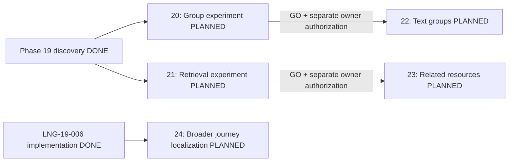

# Post-Phase-19 V2 Roadmap

Current Phase21 addendum — 2026-10-07: the owner authorized Phase21 only, including
its full experiment lifecycle. [Reviewed GO](../phases/PHASE-21-RELATIONAL-RETRIEVAL-EXPERIMENT/VERDICT.md)
meets the prospective synthetic contextual-discovery gates; final closeout is
DONE. Phase23 is technically eligible under its separate inheritance contract,
but execution unauthorized/unstarted. Phase20 DONE/GO and Phase22 eligibility are
preserved; Phase22/23/24 remain unstarted. Older planning/unstarted flags below
are historical where superseded; no next major phase is automatically authorized.

Current execution addendum — 2026-10-07: owner START_PHASE_20=YES starts
Phase 20 only. [Observed evidence](../phases/PHASE-20-STUDY-GROUP-AUTH-EXPERIMENT/EVIDENCE.md)
and canonical state supersede initial planning-only/unstarted flags below for
Phase 20. Its reviewed verdict is GO; Phase 20 is DONE. Phase 22 is
technically eligible subject to the inheritance contract and separate owner
authorization. Other phases remain PLANNED and unauthorized; no automatic next phase.

Owner-approved planning record, 2026-10-07 (Asia/Ho_Chi_Minh).
`CREATE_FUTURE_V2_ROADMAP=YES`; `START_ANY_NEW_PHASE=NO`.
This is the authoritative forward roadmap, not an execution authorization.
No future phase has started; no implementation tasks or application branches
are created by this record. Phase plans/task decompositions may be created only
when the owner separately authorizes the selected phase.

## Accepted inputs and completed work

- [Product vision](00-PRODUCT-VISION.md) and [principles](01-PRODUCT-PRINCIPLES.md):
  people-first language communities, reusable open knowledge and visible trust.
- Closed [Phase 19 portfolio](../phases/PHASE-19-GROWTH-V2/PORTFOLIO.md),
  [discovery index](../phases/PHASE-19-GROWTH-V2/DISCOVERY-INDEX.md),
  [speech/economy discovery](../phases/PHASE-19-GROWTH-V2/DISCOVERY-002-003.md),
  [groups/client/localization discovery](../phases/PHASE-19-GROWTH-V2/DISCOVERY-004-006.md)
  and [ML/retrieval discovery](../phases/PHASE-19-GROWTH-V2/DISCOVERY-007-008.md).
- Completed [LNG-19-006 implementation](../initiatives/LNG-19-006-MULTILINGUAL-UI/README.md)
  and [acceptance evidence](../initiatives/LNG-19-006-MULTILINGUAL-UI/EVIDENCE.md):
  browser-only static vi/en locale infrastructure, shared shell and complete
  public Library journey are DONE. Frontend PR #27 is already integrated.
- Planning baseline: Backend `bec4ea4ac58abcbae0eb01c0c58bf7c0fd55bae5`;
  Frontend `7cf66654da6419ca5447673e5d3782560856b4bc`;
  Workspace `0c0bfc029185261042e2bb8c66d139a61818fd48`.

Phase 19 discovery stays historically DONE. Its original recommendations are
preserved; this roadmap advances the completed multilingual candidate without
rewriting its historical BUILD_NEXT disposition. Real-user demand remains
unproven. Seed/demo/TEST/UAT data supports technical validation only. No fake
observation window or post-launch demand/retention/conversion claim is required.
Existing English copy has `EN_COPY_HUMAN_REVIEW=NOT_PERFORMED`.

## Order and dependencies

| Recommended order | Phase | Product capability | Required technical gate |
|---|---|---|---|
| 1 | 20 | Scoped study group policy and authorization experiment | Closed Phase 19; approved synthetic policy cases |
| 2 | 21 | Provenance-safe relational retrieval experiment | Closed Phase 19; current Library; reviewed synthetic benchmark |
| 3 | 22 | Bounded text study groups | Phase 20 GO and accepted membership/moderation lifecycle |
| 4 | 23 | Verified related-resource Library journey | Phase 21 GO and accepted eligibility/provenance benchmark |
| 5 | 24 | Member onboarding and language exchange localization | Completed LNG-19-006 foundation; bounded copy inventory |

The list expresses product priority, not a false linear technical dependency.
Phases 20 and 21 are independent experiments; 22 depends on 20, 23 on 21.
Phase 24 is technically independent of both tracks. Each phase needs a new
explicit owner execution authorization even when its technical entry gates pass.
The owner may select any entry-eligible planned phase; no parallel execution is
authorized now. A failed experiment does not authorize its downstream phase.



## Common release and evidence boundaries

All phase cards below inherit [working rules](engineering/CODEX-WORKING-RULES.md),
[security](05-SECURITY.md), [data licensing](04-DATA-LICENSING.md) and
[data lifecycle](08-DATA-LIFECYCLE.md). Current payment remains disabled and
production monitoring remains active; no plan selects or activates a provider.
No existing Phase 17/18 authentication, CSRF, privacy, CORS, navigation or
payment-disabled controls may be weakened.

Local/isolated TEST/UAT acceptance must be reproducible and distinguish
technical outcome from future real-user validation. Before each later phase,
recheck source architecture, licenses and dependency health; discovery is dated
evidence, not a perpetual certification. Define future real-user metrics with
cohort, denominator, seed/test exclusions and approved collection purpose before
making outcome claims. This roadmap authorizes no collection or telemetry.

Production deployment (including auto-deploying main merges), restart, env/DB
mutation, production migration, new persistent user-data collection, credential
installation, provider/account/AI/payment activation, real-money actions and
DNS/destructive infrastructure changes require explicit separate authorization.
Local migration file creation is not production execution. The Phase 18 backup
waiver applies only to recreatable demo data; meaningful private/user data needs
approved retention/deletion and a verified backup/restore plan before release.
An implementation phase may close technically with a documented production hold;
it must not claim production release acceptance without actual authorized evidence.

## Phase 20

- **PHASE_NUMBER:** 20
- **PHASE_TITLE:** Scoped Study Group Policy & Authorization Experiment
- **OBJECTIVE:** Determine whether a small text study group can have explicit,
  enforceable membership and moderation boundaries without changing existing
  author-private content semantics.
- **SOURCE_CANDIDATES:** LNG-19-004 (EXPERIMENT).
- **WHY_NOW:** Deepens the human language-community loop with no payment or
  provider prerequisite; a small negative authorization matrix can resolve the
  highest privacy uncertainty before a group product is built.
- **DEPENDENCIES:** Closed Phase 19 group discovery; existing auth/community
  boundaries; accepted synthetic membership/lifecycle cases. Independent of 21.
- **SCOPE:** Policy tabletop and isolated TEST slice with two synthetic groups,
  scoped owner/moderator/member roles, one-use invitation, member-only text,
  leave/removal, last-owner/transfer rules and moderation/report lifecycle.
  Check anonymous/nonmember/member/moderator/owner/platform-role access; cross-group
  IDOR, invite replay/races and immediate revocation across read/write/list/search,
  notifications and any existing storage path touched by the experiment.
- **OUT_OF_SCOPE:** Full groups rollout, production schema/data, real invitations,
  org tenancy/SSO, billing, uploads, audio, room integration and private-corpus export.
- **ACCEPTANCE_SUMMARY:** Deterministic negative/positive matrix and race cases
  pass in isolated TEST; old PRIVATE content remains author-only; threat model,
  abuse/retention policy and unresolved risks are explicit. Synthetic usage is
  not demand evidence.
- **PRODUCTION_HARD_STOPS:** Common boundaries apply; no production activation,
  migration or persistent real-user/group data collection belongs to this experiment.
- **ENTRY_CRITERIA:** Explicit START_PHASE_20 authorization; accepted role/policy
  cases and disposable fixture plan; fail-closed access and cleanup criteria agreed.
- **EXIT_CRITERIA:** Actual experiment evidence, reviewed policy and GO/DEFER/REJECT
  verdict recorded. GO requires no known authorization/revocation leak; DEFER/REJECT
  keeps 22 ineligible until reconciled. Future group usefulness/safe participation
  metrics are defined with denominators but not collected.
- **STATUS:** DONE

## Phase 21

- **PHASE_NUMBER:** 21
- **PHASE_TITLE:** Provenance-Safe Relational Retrieval Experiment
- **OBJECTIVE:** Test whether reviewed concept/resource relations improve source
  discovery over the current lexical baseline while preserving citation eligibility.
- **SOURCE_CANDIDATES:** LNG-19-008 (EXPERIMENT; relational, non-generative slice).
- **WHY_NOW:** Strengthens reusable Library knowledge using existing resource,
  review, license and provenance domains without an AI/vector provider.
- **DEPENDENCIES:** Closed Phase 19; existing public Library search/eligibility;
  reviewed licensed synthetic resources and query labels. Independent of 20/22.
- **SCOPE:** Isolated benchmark of lexical versus bounded relational links on the
  same eligible resource pool, with language/type/level filters, source cards,
  citations and abstention. Recheck PUBLIC/ACTIVE/VERIFIED, provenance, license,
  redistribution/source health and ACL at retrieval and response; test source
  change/deletion invalidation of projections, cache and citations.
- **OUT_OF_SCOPE:** Generated answers/RAG, embeddings, graph/vector services,
  external AI activation, new corpus ingestion, private/group retrieval and production indexes.
- **ACCEPTANCE_SUMMARY:** Reviewer-approved relevance labels and prospective
  precision@k/recall@k/abstention/support criteria are fixed before comparisons;
  actual results and denominators are reported with zero known authorization or
  provenance leaks. Preserve lexical/source-card fallback.
- **PRODUCTION_HARD_STOPS:** Common boundaries apply; no production index/migration,
  new data collection or provider/credential activation is part of this experiment.
- **ENTRY_CRITERIA:** Separate explicit phase authorization; reviewed rights/provenance
  fixtures, bounded relation vocabulary, labeled queries and acceptance thresholds.
- **EXIT_CRITERIA:** Reproducible benchmark/security evidence and GO/DEFER/REJECT
  recorded; GO needs the accepted quality criteria and zero known eligibility leaks.
  Otherwise 23 remains ineligible. Future discovery success and citation usefulness
  validation requirements are defined without real-user outcome claims.
- **STATUS:** DONE

## Phase 22

- **PHASE_NUMBER:** 22
- **PHASE_TITLE:** Bounded Text Study Groups
- **OBJECTIVE:** Deliver a small member-only text learning space with accountable
  membership, ownership and moderation, according to the proven Phase 20 policy.
- **SOURCE_CANDIDATES:** LNG-19-004, conditional promotion of its experiment.
- **WHY_NOW:** After privacy feasibility is established, adds a useful community
  capability without marketplace, payment or external-provider dependence.
- **DEPENDENCIES:** Phase 20 GO; accepted owner-transfer, revocation, moderation,
  retention and abuse policy; existing auth/community contracts. No dependency on 21.
- **SCOPE:** Bounded create/join via one-use manually shared invitation, group
  listing/detail, member-only text discussions, leave/remove/owner transfer and
  report/moderation flows. Explicit quotas, pagination and immediate access
  revocation across affected projections. Reuse the vi/en foundation for new UI;
  define additive schema/API contracts only within later approved implementation.
- **OUT_OF_SCOPE:** Organization tenancy/SSO, paid seats/marketplace, uploads/audio,
  event/room integration, provider email invitations, private AI/corpus export and
  repurposing existing author-private posts as group content.
- **ACCEPTANCE_SUMMARY:** Full lifecycle and negative cross-group role matrix,
  race/replay/idempotency, isolation, moderation and removal/deletion tests pass;
  scoped vi/en accessible responsive runtime at 320–1440 and relevant regressions
  pass in local/TEST. No real-user demand or retention improvement is claimed.
- **PRODUCTION_HARD_STOPS:** Common boundaries apply; private persistent group
  data needs explicit collection/policy approval, verified backup/restore and
  separately authorized production migration/deployment. Demo backup waiver does
  not cover this data.
- **ENTRY_CRITERIA:** Separate owner phase/implementation authorization; Phase 20
  GO; reviewed policy, bounded capability contracts and TEST acceptance plan.
- **EXIT_CRITERIA:** Bounded technical capability, security/privacy/runtime gates,
  evidence and handoff complete; production release separately accepted or explicitly
  held. Future helpful group contributions and moderation/revocation outcomes have
  defined denominators and privacy-safe validation requirements.
- **STATUS:** PLANNED

## Phase 23

- **PHASE_NUMBER:** 23
- **PHASE_TITLE:** Verified Related-Resource Library Journey
- **OBJECTIVE:** Add source-grounded related-resource exploration to the existing
  public Library through the relational approach validated by Phase 21.
- **SOURCE_CANDIDATES:** LNG-19-008, conditional non-generative experiment promotion.
- **WHY_NOW:** Compounds trusted open knowledge with deterministic source navigation;
  uses current Library contracts and completed locale infrastructure.
- **DEPENDENCIES:** Phase 21 GO and accepted relation vocabulary/benchmark;
  current Library and completed LNG-19-006. No dependency on private groups/22.
- **SCOPE:** Bounded public relation projection and paginated related-resource
  source cards/navigation, language/type/level eligibility, provenance/license
  display and current access/source-health rechecks. Invalidate stale/deleted
  relations and retain lexical fallback/abstention. Localize only the new UI in vi/en.
- **OUT_OF_SCOPE:** Redoing completed Library localization; generated answers,
  full knowledge graph platform, embeddings/vector infra, external AI, automatic
  corpus ingestion, private/group content and translating learning content.
- **ACCEPTANCE_SUMMARY:** Accepted benchmark criteria still pass after integration;
  zero known eligibility/citation leakage; stale-source, deletion, filter, fallback,
  route, accessible responsive runtime and full relevant regression tests pass.
- **PRODUCTION_HARD_STOPS:** Common boundaries apply; any production projection/
  migration/deployment needs separate authorization. No AI/provider or telemetry activation.
- **ENTRY_CRITERIA:** Separate owner phase/implementation authorization; Phase 21
  GO; reviewed rights, relation ownership/update process and bounded TEST contracts.
- **EXIT_CRITERIA:** Technical source-navigation journey and security/runtime
  acceptance complete, evidence and handoff recorded; production release accepted
  separately or held. Future resource-discovery success and citation usefulness
  have explicit cohorts/denominators, without fabricated live outcomes.
- **STATUS:** PLANNED

## Phase 24

- **PHASE_NUMBER:** 24
- **PHASE_TITLE:** Member Onboarding & Language Exchange Localization
- **OBJECTIVE:** Extend vi/en UI to the connected member journey from authentication
  through onboarding/language profile to finding a language-exchange partner.
- **SOURCE_CANDIDATES:** LNG-19-006 (additional product rollout, not reimplementation).
- **WHY_NOW:** Makes a distinct core community journey accessible in English after
  the bounded shell/Library delivery; reuses a proven locale foundation rather than
  translating the entire platform at once. Priority follows the experimental tracks,
  but the owner may select this independently when entry gates are ready.
- **DEPENDENCIES:** Completed LNG-19-006 locale infrastructure; existing identity,
  profile and exchange routes/contracts; bounded copy inventory. Independent of 20–23.
- **SCOPE:** Domain-owned vi/en catalogs and approved error/accessibility copy for
  existing authentication, onboarding/profile language controls and exchange browse/
  partner detail states. Reuse browser-only locale persistence, Intl formatting and
  vi fallback; preserve content/learning-language and session/route independence.
  Include human English review disposition and approved consent/legal label mapping.
- **OUT_OF_SCOPE:** Redoing shell/Library/foundation, all-product translation, third
  locale, content translation, altered legal terms, provider emails/translation APIs,
  server locale profile/schema and locale-prefixed URLs.
- **ACCEPTANCE_SUMMARY:** Catalog completeness, safe error mapping, locale switching/
  reload, learning-language/session/URL independence, keyboard/a11y, long-copy and
  seven-width responsive runtime pass; full relevant auth/navigation/exchange tests
  pass. Technical copy completion remains distinct from actual human certification.
- **PRODUCTION_HARD_STOPS:** Common boundaries apply, including auto-deploying
  Frontend main merge; production deployment needs separate authorization. No new
  data/provider collection is needed. Do not claim reviewed English without a reviewer.
- **ENTRY_CRITERIA:** Separate explicit phase authorization; approved bounded copy
  inventory/terminology and consent/legal copy ownership; existing locale/API contracts.
- **EXIT_CRITERIA:** New member journey technically accepted with truthful copy-review
  status and release hold where necessary; externally reviewed English requires actual
  human sign-off. Future onboarding task success/locale usefulness measurements are
  defined for later approved validation, never inferred from seed/UAT results.
- **STATUS:** PLANNED

## Deferred candidate re-entry gates

These are conditional gates, not scheduled execution phases. Passing a gate
permits a new owner-reviewed portfolio/roadmap decision; it does not activate work.
No phase number, implementation task or provider account is allocated here.

| Candidate / retained disposition | Required re-entry evidence and approvals |
|---|---|
| LNG-19-002 Speech — DEFER | Legally usable accent/language-balanced benchmark with human references and prospectively accepted scoring accuracy/fairness criteria; ASR is not pronunciation scoring. Validated provider language/scoring capability, retention/region/data-processing terms and cost limits; dataset/audio rights and consent/withdrawal/deletion model; ownership/upload/abuse tests; explicit account/credential/recording/provider activation approvals. Synthetic scores cannot establish scoring validity. |
| LNG-19-003 Expert / Teacher Economy — DEFER | Approved legal/accreditation/consumer/tax model, provider selection by owner, payout/settlement/refund/dispute responsibilities, reconciliation/fraud controls, support staffing and sustainable operational cost; verified TEST transaction state contracts and separately authorized production credentials/payment/webhooks/live money. Existing EXPERT role or membership checkout proves none of these. |
| LNG-19-005 Native / Wrapper — DEFER_NATIVE_RETAIN_PWA | Reproducible capability gap against the current PWA on a defined physical-device/browser matrix; evaluated PWA remediation and one bounded native/wrapper alternative with no duplicate domain logic; measured accessibility/offline/session/security behavior, platform/store maintenance and cost; separate account/credential/push/production approvals. Store presence alone is insufficient. |
| LNG-19-007 Recommendation ML — DEFER | Trustworthy permissioned interaction/outcome dataset with provenance, cohort/denominators, seed/test exclusion, deletion/retention and exposure/selection-bias handling; frozen existing deterministic eligibility/safety baseline; prospectively defined evaluation, fairness, quality and operational improvement justification over simple heuristics. No model merely for sophistication; no synthetic demand or new tracking authorization from this plan. |
| LNG-19-008 Generated RAG extension — DEFER beyond relational slice | Mature rights-cleared eligible corpus, per-response authorization/provenance/citation validation and invalidation; reviewed groundedness/abstention/adversarial benchmark, operational budget and explicit AI/provider/data-processing approvals. Phase 21/23 relational success does not authorize generated answers. |
| LNG-19-004 Organization/tenant extension — outside bounded group scope | Separate tenancy/admin/privacy/retention and migration threat model; validated organization need and operational ownership; explicit owner scope approval. Small-group membership success is not tenant isolation proof. |

## Planning validation — 2026-10-07

Independent read-only review of the full roadmap, four governance diffs,
Phase 19 portfolio/discoveries and completed locale initiative: PASS, no material
findings. Local structure/link checks: five unique ordered PLANNED phase cards,
all 13 required fields, 17 local links and declared acyclic dependency graph PASS.
Security/privacy review and secret-pattern scan PASS; no application, secret,
workflow or infrastructure change. Existing monitor syntax check and all 12
offline monitor tests PASS. Diff whitespace check PASS.
Application typecheck/build/runtime are not applicable to this documentation-only
change; no new product runtime or production acceptance is claimed. Integration
and post-merge CI/cleanup are verified through the linked Workspace PR history.

## Planning completion boundary

```text
V2_ROADMAP_STATUS=PLANNED
FUTURE_PHASE_EXECUTION_AUTHORIZED=NO
NEXT_PLANNED_PHASE=20_SCOPED_STUDY_GROUP_POLICY_AND_AUTHORIZATION_EXPERIMENT
PHASE_19_DONE=YES
LNG_19_006_IMPLEMENTATION=DONE
LNG_19_006_REIMPLEMENTATION_PLANNED=NO
PHASE_20_STARTED=NO
NO_NEW_PHASE_STARTED=YES
PAYMENT_REMAINS_DISABLED=YES
MONITORING_ACTIVE=YES
NEXT_ACTION=WAIT_FOR_OWNER_TO_AUTHORIZE_ONE_PLANNED_PHASE
```

Integrate this planning record through Workspace PR/CI/merge/cleanup, then STOP.
Any relay report must preserve that boundary; a generated continuation prompt
cannot replace the required explicit owner authorization for phase execution.
