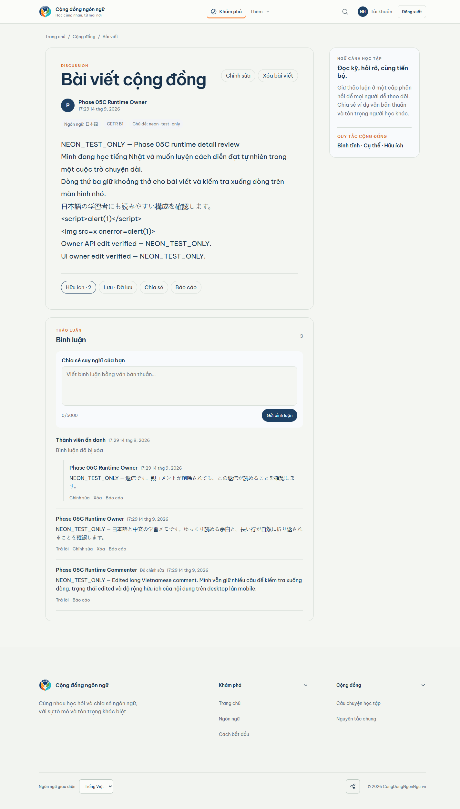

# Phase 05C desktop detail comparison

Canonical Stitch screen: `51fd56d9452c48d198f814f89c6baa36` 
Viewport: 1440 
Runtime data: `NEON_TEST_ONLY` against the authorized Neon TEST database

| Canonical Stitch | Populated runtime |
| --- | --- |
|  |  |

## Concrete review

- Both surfaces establish a two-column detail composition with the main discussion canvas and a learning-context rail.
- The runtime contains the real post body, author, Japanese metadata, CEFR, topic, Helpful/Save/Share/Report row, authenticated composer, three remaining comments, deleted-parent placeholder, and visible reply.
- Stitch uses individual bordered comment cards and more explicit thread grouping. Runtime uses one comments card with divider-separated comment rows.
- Stitch shows header save/share/overflow controls and a four-card learning rail. Runtime shows owner Edit/Delete beside the generic detail heading and one concise learning-context card.
- Stitch’s deleted parent is a dashed explanatory block. Runtime preserves the parent/reply relationship and plain-text placeholder semantics, but the visual treatment is simpler.

Decision: `VISUAL_DETAIL_1440=REVIEW`; no frontend fidelity change was made during this evidence pass.
