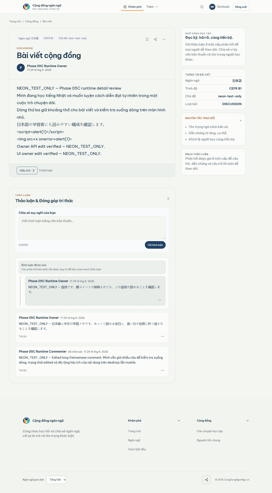

# Phase 05C desktop detail comparison

Canonical Stitch screen: `51fd56d9452c48d198f814f89c6baa36` 
Viewport: 1440 
Runtime data: `NEON_TEST_ONLY` against the authorized Neon TEST database

| Canonical Stitch | Populated runtime |
| --- | --- |
|  |  |

## Concrete review

- Both surfaces establish a two-column detail composition with the main discussion canvas and a learning-context rail.
- The runtime contains the real post body, author, Japanese metadata, CEFR, topic, Helpful/Save/Share/Report row, authenticated composer, three remaining comments, deleted-parent placeholder, and visible reply.
- Stitch uses individual bordered comment cards and more explicit thread grouping. Runtime uses one comments card with divider-separated comment rows.
- Stitch shows header save/share/overflow controls and a four-card learning rail. Runtime shows owner Edit/Delete beside the generic detail heading and one concise learning-context card.
- Stitch’s deleted parent is a dashed explanatory block. Runtime preserves the parent/reply relationship and plain-text placeholder semantics, but the visual treatment is simpler.

Decision: `VISUAL_DETAIL_1440=REVIEW`; no frontend fidelity change was made during this evidence pass.

## Final remediation review

Date: 2026-09-14 
Frontend remediation: `d674578ae2c3f139b625200fe95d0f6c46bf0f14` 
Viewport: 1440 
Runtime data: `NEON_TEST_ONLY` against the authorized Neon TEST database

| Canonical Stitch | Final populated runtime |
| --- | --- |
|  |  |

Concrete before → after findings:

- Comments/card grouping: the enclosing discussion surface now contains individually bordered comment cards, an explicit deleted-parent placeholder, retained reply grouping, and an inline reply composer.
- Action placement: Save, Share, and the contextual menu are in the post header; Helpful and discussion count remain in the post action row; owner and report actions are menu items without duplicate bottom-row actions.
- Learning rail: the desktop rail now has four structural cards using only actual post metadata plus generic discussion guidance; no fabricated recommendations or scores.
- Deleted parent: original content and author remain absent; the neutral dashed placeholder explains continuity and the visible reply remains indented.
- Typography and rhythm: metadata, author row, action divider, comment spacing, reply indentation, and composer placement follow the locked desktop hierarchy.

Decision: `VISUAL_DETAIL_1440=PASS`. 
`MATERIAL_DIFFERENCES=NONE` for the locked structural comparison. Dynamic names, timestamps, counts, and test content remain intentionally runtime-specific.
