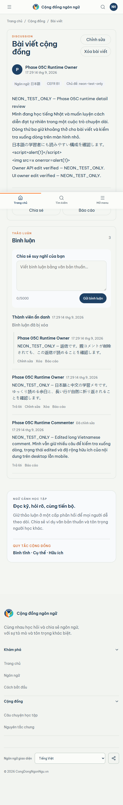

# Phase 05C mobile detail comparison

Canonical Stitch screen: `5c3d5fbc3ac646a183425122e9ae57f5` 
Viewport: 390 
Runtime data: `NEON_TEST_ONLY` against the authorized Neon TEST database

| Canonical Stitch | Populated runtime |
| --- | --- |
|  |  |

## Concrete review

- Runtime remains readable at 390px and at the wider/narrower matrix widths; no horizontal overflow was observed.
- The runtime global mobile header and bottom navigation remain in place. Stitch specifies a detail-specific back/title/save/share header.
- Stitch presents more compact metadata pills, individually grouped thread cards, an explicit deleted-parent explanatory block, and a visible depth-1 reply relationship. Runtime preserves the data and indentation but uses the existing detail component’s simpler row treatment.
- Runtime owner Edit/Delete controls are visible for USER_A, and the authenticated comment composer is usable. Their placement differs from the canonical mobile detail chrome.
- The full-page runtime capture shows the fixed global navigation in its normal viewport position; during an interactive scroll the action row and composer remain reachable.

Decision: `VISUAL_DETAIL_390=REVIEW`; no frontend fidelity change was made during this evidence pass.
