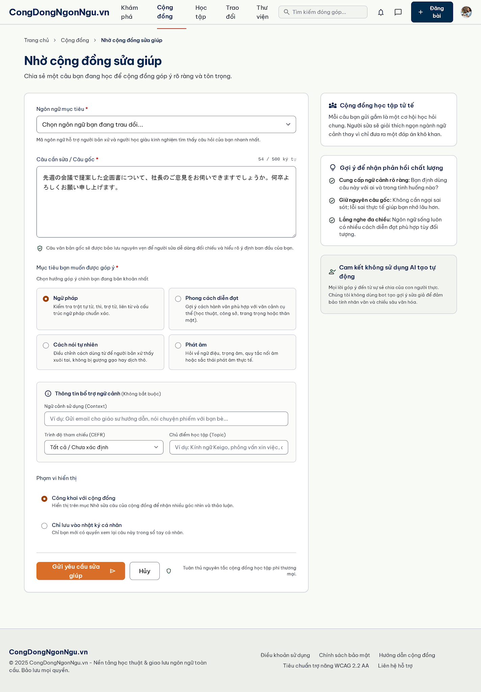
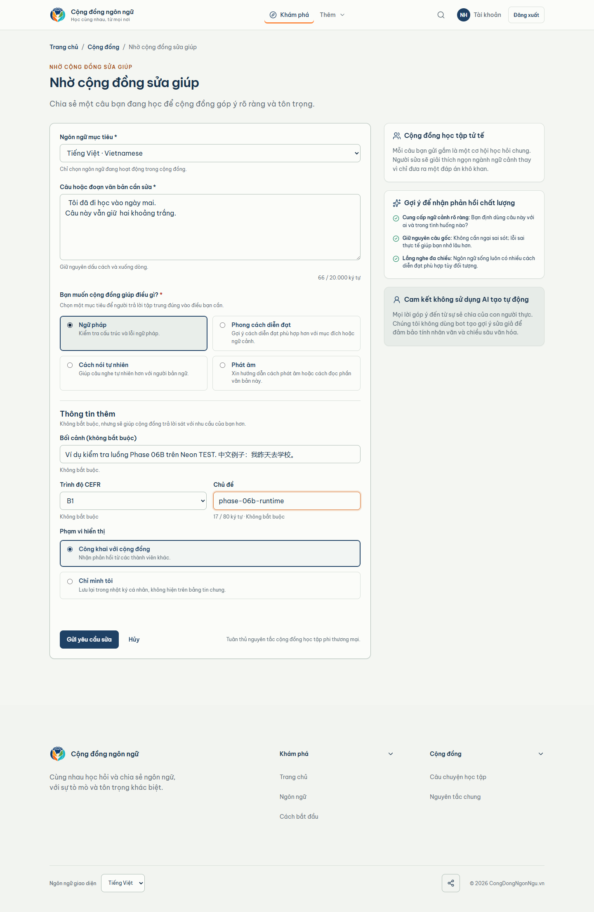

# Correction — Desktop comparison (1440px)

| Locked Stitch canonical | Real populated runtime |
| --- | --- |
|  |  |

Concrete review notes:

- Composition, title/subtitle hierarchy, original-text emphasis, language
  selector, intent grouping, metadata section, visibility controls, and
  action placement match the locked desktop structure.
- The runtime uses real Vietnamese/CJK TEST content and dynamic counts; these
  are expected non-material differences.
- Final result: VISUAL_CORRECTION_1440=PASS,
  MATERIAL_DIFFERENCES=NONE.
