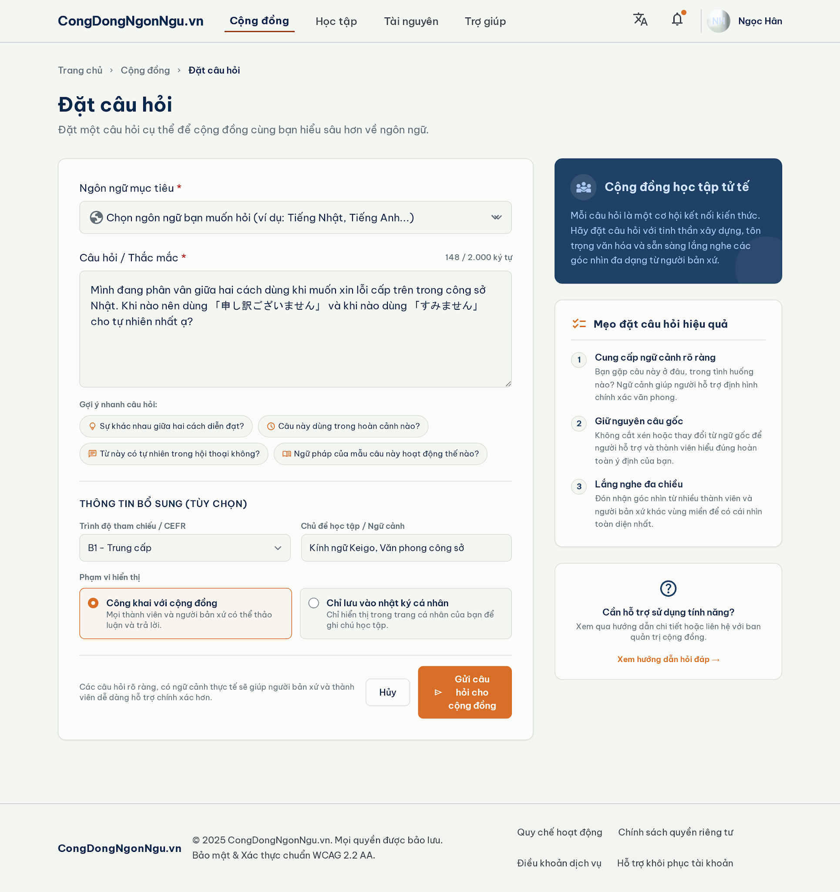
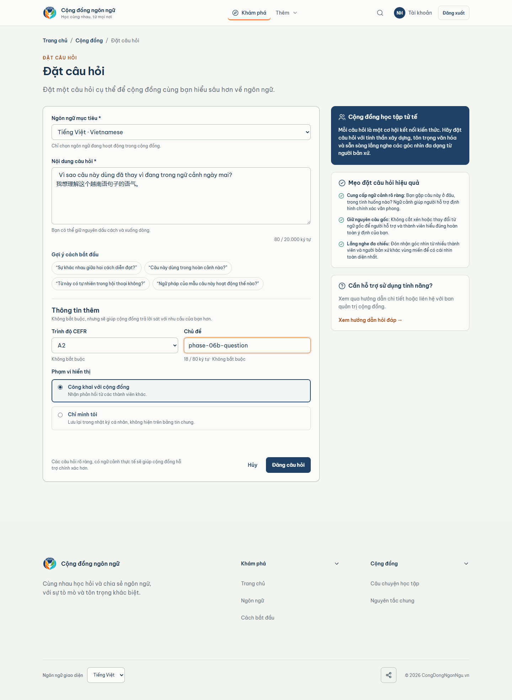

# Question — Desktop comparison (1440px)

| Locked Stitch canonical | Real populated runtime |
| --- | --- |
|  |  |

Concrete review notes:

- Composition, title/subtitle hierarchy, question textarea, language
  selector, example chips, optional metadata, visibility, action grouping,
  and three-card guidance rail match the locked desktop structure.
- The runtime uses real Vietnamese/CJK TEST content and dynamic counts; these
  are expected non-material differences.
- Final result: VISUAL_QUESTION_1440=PASS,
  MATERIAL_DIFFERENCES=NONE.
