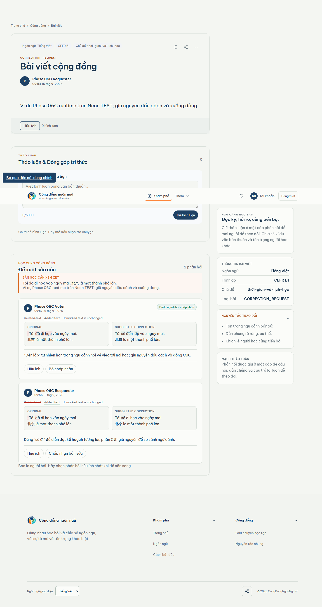

# Phase 06C visual comparison — correction desktop

Viewport: 1440px
Canonical Stitch: 6b1d27c554874ba28b0445321ea5ff73
Runtime data: Neon TEST, authenticated Context A

| Locked Stitch reference | Real runtime capture |
| --- | --- |
|  |  |

Review result: VISUAL_CORRECTION_1440=PASS

Material difference result: NONE.

The runtime preserves the Stitch composition and hierarchy: community post
shell, metadata/sidebar, correction request block, original/corrected
comparison, explanation, Helpful and requester acceptance controls. Dynamic
TEST content, response counts, author names, and the accepted-by-requester
badge are expected populated-runtime differences.
