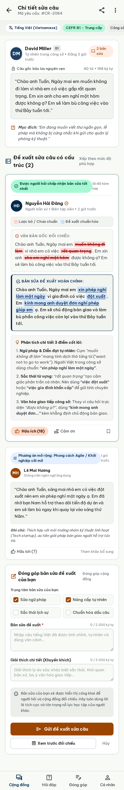
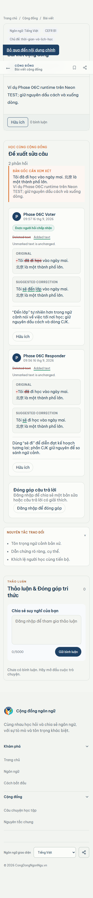

# Phase 06C visual comparison — correction mobile

Viewport: 390px
Canonical Stitch: 5dd468a98e9f4e78abfa0dd2876d963c
Runtime data: Neon TEST, authenticated Context A

| Locked Stitch reference | Real runtime capture |
| --- | --- |
|  |  |

Review result: VISUAL_CORRECTION_390=PASS

Material difference result: NONE.

The runtime keeps the mobile stack, readable original/corrected panels,
semantic diff cues, explanation, Helpful, acceptance, discussion, and footer
structure. Dynamic TEST content and the populated accepted state are expected
differences; no clipped controls or horizontal overflow were observed.
