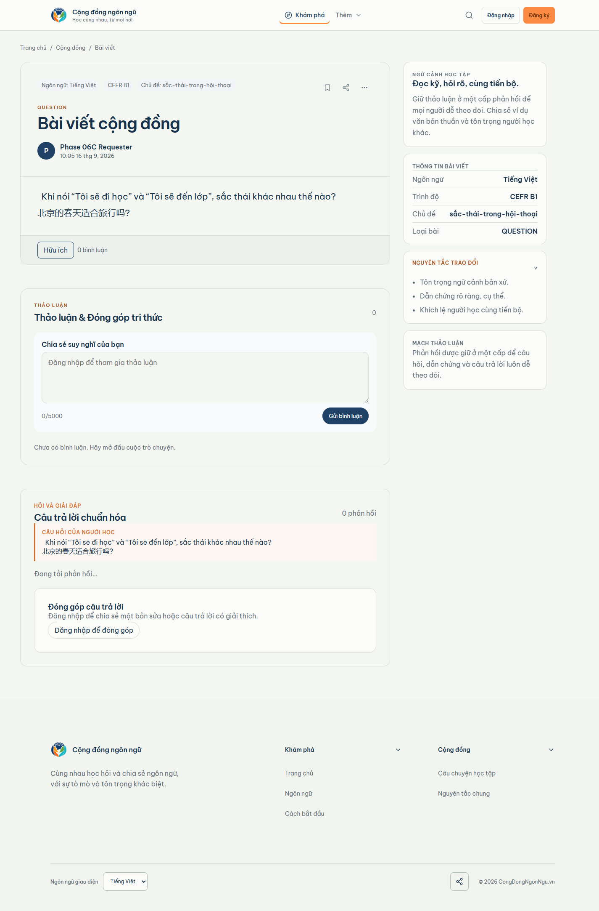

# Phase 06C visual comparison — question desktop

Viewport: 1440px
Canonical Stitch: 00b56f19add842ffa17fb28e796b709c
Runtime data: Neon TEST, authenticated Context A

| Locked Stitch reference | Real runtime capture |
| --- | --- |
|  |  |

Review result: VISUAL_QUESTION_1440=PASS

Material difference result: NONE.

The runtime preserves the desktop question shell, question hierarchy,
structured answer region, formal answer card, Helpful control, requester
acceptance state, discussion area, and supporting sidebar. Dynamic TEST copy,
response count, author, and accepted-by-requester badge are expected
populated-runtime differences.
