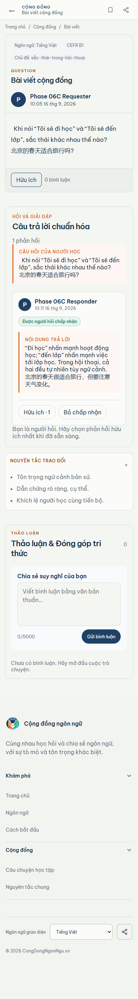

# Phase 06C visual comparison — question mobile

Viewport: 390px
Canonical Stitch: 1f3d9d68d2b84f809e46db969570443d
Runtime data: Neon TEST, authenticated Context A

| Locked Stitch reference | Real runtime capture |
| --- | --- |
|  |  |

Review result: VISUAL_QUESTION_390=PASS

Material difference result: NONE.

The runtime keeps the mobile question/answer stack, readable formal answer,
Helpful state, accepted-by-requester state, discussion section, and footer
layout. Dynamic TEST text and populated counts are expected differences; no
clipped controls or horizontal overflow were observed.
