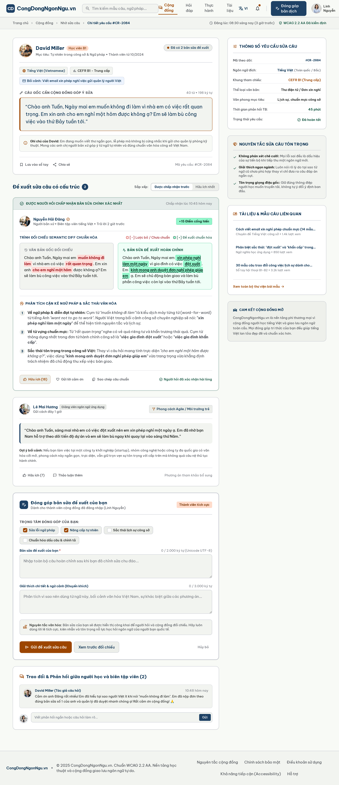
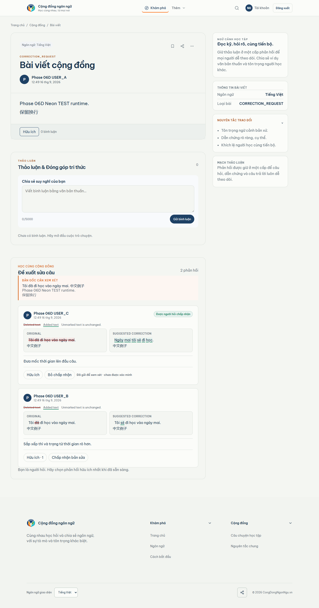

# Phase 06D visual comparison - correction desktop

Viewport: 1440px wide, populated Neon TEST runtime, full-page capture.

Locked Stitch reference: 6b1d27c554874ba28b0445321ea5ff73

| Locked Stitch reference | Actual runtime capture |
| --- | --- |
|  |  |

Runtime state includes original source, corrected text, diff cues,
explanation, Helpful, accepted-by-requester state, and the restrained pending
library-candidate action/status. Generic comments remain separate.

    MATERIAL_DIFFERENCES=NONE_OBSERVED
    VISUAL_CORRECTION_1440=REVIEW
    OWNER_VISUAL_ACCEPTANCE_06D=PENDING

The REVIEW status is the owner gate, not a discovered structural mismatch.
