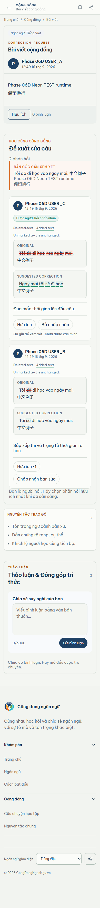

# Phase 06D visual comparison - correction mobile

Viewport: 390px wide, populated Neon TEST runtime, full-page capture.

Locked Stitch reference: 5dd468a98e9f4e78abfa0dd2876d963c

| Locked Stitch reference | Actual runtime capture |
| --- | --- |
|  |  |

Runtime state includes the original/corrected stack, readable diff cues,
explanation, Helpful, accepted-by-requester state, and pending candidate state.
Controls remain readable and accessible at the mobile width.

    MATERIAL_DIFFERENCES=NONE_OBSERVED
    VISUAL_CORRECTION_390=PASS
    OWNER_VISUAL_ACCEPTANCE_06D=YES

The REVIEW status is the owner gate, not a discovered structural mismatch.
