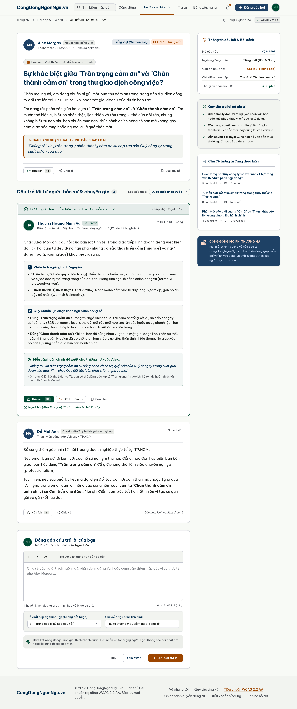
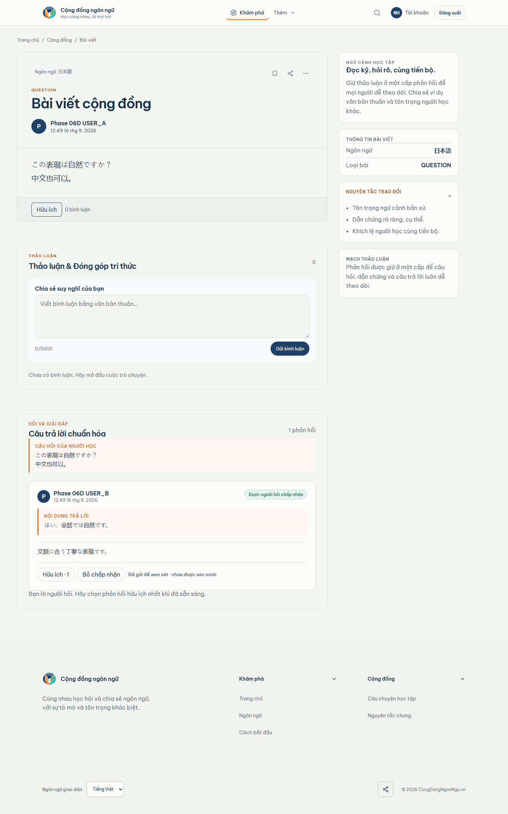

# Phase 06D visual comparison - question desktop

Viewport: 1440px wide, populated Neon TEST runtime, full-page capture.

Locked Stitch reference: 00b56f19add842ffa17fb28e796b709c

| Locked Stitch reference | Actual runtime capture |
| --- | --- |
|  |  |

Runtime state includes the formal structured answer, CJK question content,
Helpful, accepted-by-requester state, generic-comment separation, and the
pending library-candidate action/status.

    MATERIAL_DIFFERENCES=NONE_OBSERVED
    VISUAL_QUESTION_1440=REVIEW
    OWNER_VISUAL_ACCEPTANCE_06D=PENDING

The REVIEW status is the owner gate, not a discovered structural mismatch.
