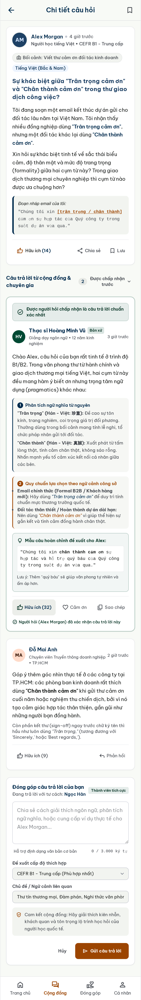
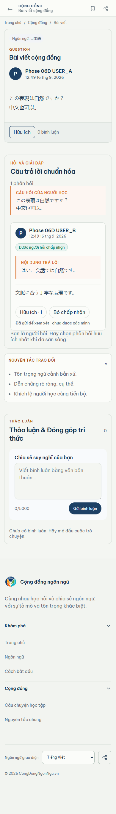

# Phase 06D visual comparison - question mobile

Viewport: 390px wide, populated Neon TEST runtime, full-page capture.

Locked Stitch reference: 1f3d9d68d2b84f809e46db969570443d

| Locked Stitch reference | Actual runtime capture |
| --- | --- |
|  |  |

Runtime state includes the formal answer, Helpful, accepted-by-requester
state, generic-comment separation, and pending candidate state in the mobile
layout. No clipped action or horizontal overflow was observed.

    MATERIAL_DIFFERENCES=NONE_OBSERVED
    VISUAL_QUESTION_390=REVIEW
    OWNER_VISUAL_ACCEPTANCE_06D=PENDING

The REVIEW status is the owner gate, not a discovered structural mismatch.
